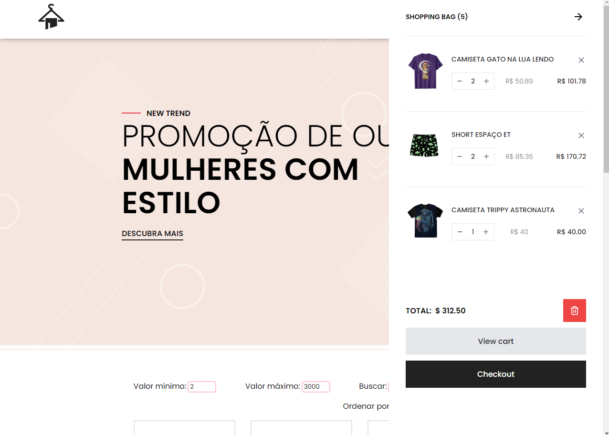
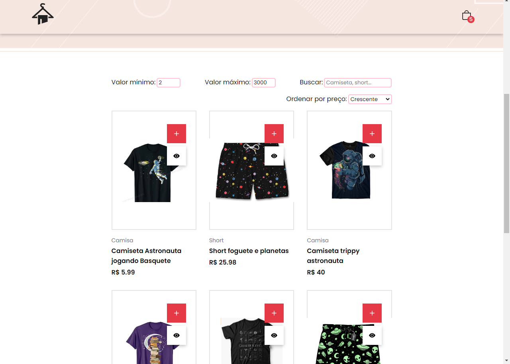

 
 <h1 align="center">LabeCommerce</h1>

 <a href="#-layout">Layout  |</a> 
 <a href="#-tecnologia">Technology |</a> 
 <a href="#-project">Project |</a> 
 <a href="#memo-liceça">License</a> 

## 🎨 Layout

 
 
 

## 💻 Project

Live preview: https://labecommercer.netlify.app/

This application has:

- Page Home (Lista de Produtos)
  - O usuário consegue visualizar uma lista de produtos
  - O usuário consegue visualizar os dados do produto (nome, preço e imagem)
  - O usuário consegue adicionar o produto no carrinho
  - O usuário consegue ir para página de Detalhes
- Carrinho
  - O usuário consegue visualizar os produtos adicionados
  - O usuário consegue visualizar a quantidade correta de cada produto
  - O usuário consegue remover itens do carrinho
  - O usuário consegue ver corretamente o valor total de sua compra
  - Quando a página é atualizada, os itens continuam no carrinho
- Filtros e Ordenação
  - O usuário consegue filtrar os itens por preço mínimo
  - O usuário consegue filtrar os itens por preço máximo
  - O usuário consegue realizar uma busca por nome
  - O usuário consegue ordenar os itens em ordem crescente ou decrescente
  - O usuário consegue adicionar filtros, busca e ordenação simultaneamente
  - O usuário consegue retornar à visualização sem filtros
- Page Product Details
  - O usuário consegue ver a imagem do produto
  - O usuário consegue ver a descrição do produto
  - O usuário consegue adicionar o produto no carrinho
  - O usuário consegue voltar para página Home

## 🚀 Tecnologias

This project was developed with the following technology:

- React.JS
- Styled Components
- JavaScript
- Node.JS
- Git and Github

## :memo: Licença

This project is under the MIT license

 

Made with 💜 by myself : [My contact!] [contatothaissabarbosa@gmail.com]

